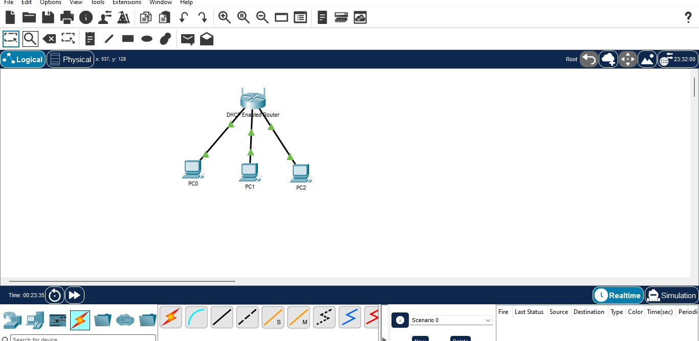
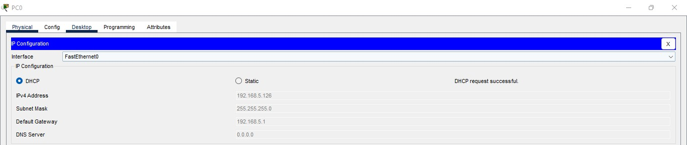

# DHCP-Configuration-Wireless-Router
Navigating between static and dynamic IP addressing using DHCP.

# Dynamic Host Configuration Protocol (DHCP) on a Wireless Router

This lab demonstrates transitioning from static network assumptions to automated dynamic host configuration using DHCP. The project covers configuring a home wireless router's internal DHCP scope, modifying local subnet addressing, updating client lease reservations, and verifying automated IP distribution and end-to-end ICMP connectivity across multiple client endpoints.

---

## The Core Concept: Manual Static vs. Automated Dynamic Addressing
* **Static Addressing (Manual):** Requires an administrator to configure the IP address, subnet mask, default gateway, and DNS on every device individually. While functional on tiny topologies, it introduces administrative overhead, human typo errors, and IP collisions as endpoints scale.
* **Dynamic Addressing (DHCP):** Centralizes IP management on the router. When hosts join the network, they exchange DHCP messages (DORA: Discover, Offer, Request, Acknowledge) to automatically receive an IP lease within a designated scope, along with subnet and gateway parameters.

---

## Network Topology & Addressing Design



### Addressing Table

| Device | Interface | IP Address | Subnet Mask | Default Gateway | Assignment Type |
|---|---|---|---|---|---|
| Wireless Router | LAN Port (Internal) | 192.168.5.1 | 255.255.255.0 | N/A | Static (Gateway) |
| PC0 | FastEthernet0 | 192.168.5.126 | 255.255.255.0 | 192.168.5.1 | DHCP Leased |
| PC1 | FastEthernet0 | 192.168.5.127 | 255.255.255.0 | 192.168.5.1 | DHCP Leased |
| PC2 | FastEthernet0 | 192.168.5.128 | 255.255.255.0 | 192.168.5.1 | DHCP Leased |

### DHCP Scope Parameters
* **Internal Network Subnet:** `192.168.5.0/24`
* **Default Gateway:** `192.168.5.1`
* **Starting Dynamic IP:** `192.168.5.126`
* **Maximum Leased Users:** `75`
* **Available Lease Range:** `192.168.5.126` – `192.168.5.200`

---

## Lab Implementation Steps

### Part 1: Connecting Physical Endpoints
Three generic PCs (`PC0`, `PC1`, `PC2`) were cabled directly to the Ethernet switch ports of the wireless router using copper straight-through cables.

### Part 2: Inspecting Default Router Configuration
1. Configured `PC0` to obtain an initial dynamic IP from the router's factory default scope (`192.168.0.0/24`).
2. Verified initial gateway acquisition at `192.168.0.1`.
3. Navigated to the router's embedded web management interface via `http://192.168.0.1` and authenticated using default credentials (`admin`/`admin`).

### Part 3: Modifying Router Gateway Subnet
1. Under **Network Setup**, changed the local router IP address from `192.168.0.1` to `192.168.5.1` (Subnet Mask: `255.255.255.0`).
2. Saved the configuration. 
> **Observation:** Changing the router's IP caused the browser session to immediately return a `Request Timeout`. Because the router was shifted to the `192.168.5.0/24` network while `PC0` still held an obsolete `192.168.0.x` lease, inter-segment communication dropped until client DHCP leases were refreshed.

### Part 4: Adjusting the DHCP Scope & Allocation Pool
1. Toggled `PC0` from **Static** back to **DHCP** to renew its address on the new `192.168.5.x` subnet.
2. Re-opened the browser at `http://192.168.5.1`.
3. Adjusted the pool parameters under **DHCP Server Settings**:
   * **Start IP Address:** `192.168.5.126`
   * **Maximum Number of Users:** `75`
4. Saved settings to apply the constrained pool.


---

## Verification & Results

### 1. Dynamic IP Lease Verification
Renewed DHCP on all connected clients. Each host successfully received an IP address sequentially within the defined lease range:
* `PC0`: `192.168.5.126`
* `PC1`: `192.168.5.127`
* `PC2`: `192.168.5.128`



Verified host parameters via the command line using `ipconfig`:
```text
C:\> ipconfig

FastEthernet0 Connection: (default port)
   Link-local IPv6 Address.........: FE80::201:C9FF:FEBD:1D61
   IPv4 Address....................: 192.168.5.128
   Subnet Mask.....................: 255.255.255.0
   Default Gateway.................: 192.168.5.1
   
