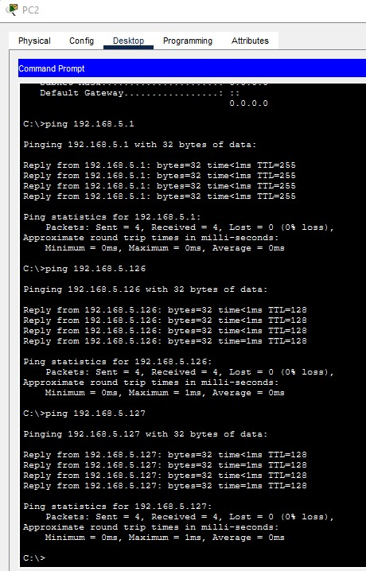
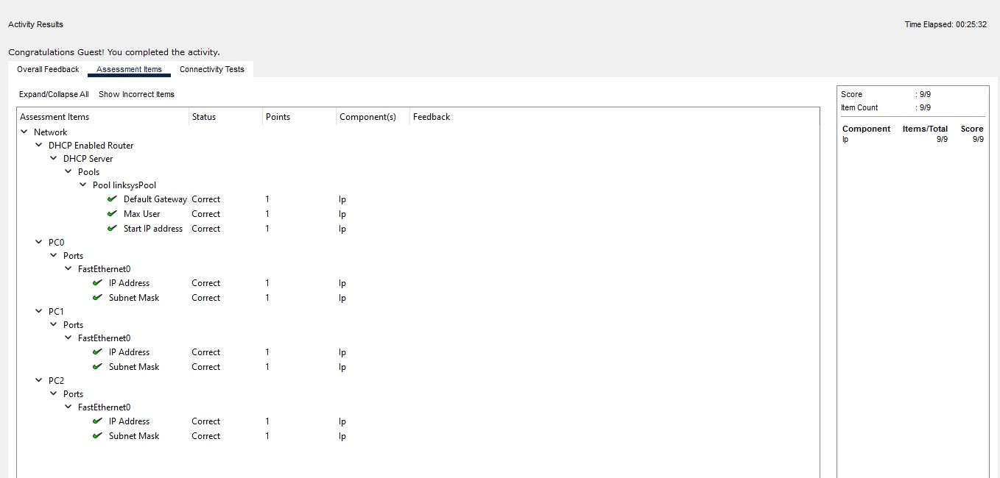

# Automating Host Addressing via DHCP

A Cisco Packet Tracer lab demonstrating how Dynamic Host Configuration Protocol (DHCP) replaces manual static IP configuration by dynamically distributing network parameters to end hosts across a local area network .

---

## Topology & Network Design

* **Default Gateway:** `192.168.5.1 /24` 
* **DHCP Scope Start:** `192.168.5.126` 
* **Capacity:** 75 hosts (`192.168.5.126` – `192.168.5.200`) 

| Device | Interface | IP Address | Subnet Mask | Default Gateway | Type |
|---|---|---|---|---|---|
| Wireless Router | LAN | 192.168.5.1 | 255.255.255.0 | N/A | Static |
| PC0 | FastEthernet0 | 192.168.5.126 | 255.255.255.0 | 192.168.5.1 | DHCP Leased |
| PC1 | FastEthernet0 | 192.168.5.127 | 255.255.255.0 | 192.168.5.1 | DHCP Leased |
| PC2 | FastEthernet0 | 192.168.5.128 | 255.255.255.0 | 192.168.5.1 | DHCP Leased |

---

## Lab Implementation

### 1. Gateway Subnet Reconfiguration
* Navigated to the router GUI at `192.168.0.1` and shifted internal subnet addressing to `192.168.5.1/24` .
* **Observation:** The active browser session timed out immediately because the gateway moved to a new logical subnet while the host retained its stale `192.168.0.x` lease . Toggling DHCP refreshed the host into the new gateway subnet .

### 2. DHCP Pool Setup
Restricted dynamic allocation to reserve lower addresses for future static infrastructure :
* **Start IP:** `192.168.5.126` 
* **Maximum Users:** `75` 

---

## Verification & Connectivity

* **Lease Verification:** Renewed DHCP on all endpoints. `PC0`, `PC1`, and `PC2` sequentially obtained addresses within the `.126`–`.128` scope .

* **ICMP Testing:** From `PC2`, executed ping tests to confirm communication with the gateway and neighboring dynamic hosts (0% loss) .

* **Lab Assessment:** Completed 100% of assessment items for router services and host addressing .

---

## Key Takeaways
* **Automation Over Manual Entry:** DHCP removes manual configuration errors, prevents duplicate IP conflicts, and automates host onboarding .
* **Address Reservation:** Restricting the starting IP scope (`.126`) preserves lower host addresses for static network infrastructure like printers and servers .
* **Subnet Alignment:** Changing a local gateway IP drops client access until dynamic leases are released and renewed on the new subnet .
